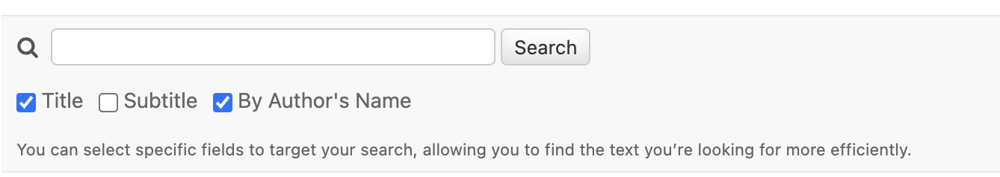

django-admin-search-fields
============

The django-admin-search-fields feature empowers users to dynamically select search fields on the list page of the Django admin. This capability provides flexibility and improves the user experience by allowing administrators to tailor their search queries based on the context of their data exploration needs.




Key Benefits
-----------
* **Customizable Search Experience**: Users can specify which fields to search on the fly, making it easier to perform targeted queries.
* **Enhanced Usability**: Provides an intuitive interface to select search fields, improving efficiency in data management.
* **Performance Optimization**: Reduces the overhead of searching across unnecessary fields, enhancing query performance.


How To Use
-----------

1. Install package with `pip install django-admin-search-fields`.


2. Add `django_admin_search_fields` to  `INSTALLED_APPS` in your `settings.py`. `django_admin_search_fields` should placed before the used apps:
```
    INSTALLED_APPS = [
        ...,
        "django_admin_search_fields",
        ...
        "your_app"
    ]
```

3. Import and inherit `DjangoAdminSearchFieldModelAdmin` to your custom model admin class and set `search_field_choices` like below:

``` 
    from django_admin_search_fields.admin import DjangoAdminSearchFieldModelAdmin
    
    class PostAdmin(DjangoAdminSearchFieldModelAdmin):
        search_field_choices = (
            ('title', True, 'Title'),  # Prechecked by default
            ('subtitle', False),       # Not prechecked by default
            ('author__first_name', False, _("Author's first name"))  # Requires a verbose name for relational fields
        )
        ...
    
    admin.site.register(Post, PostAdmin)

```
